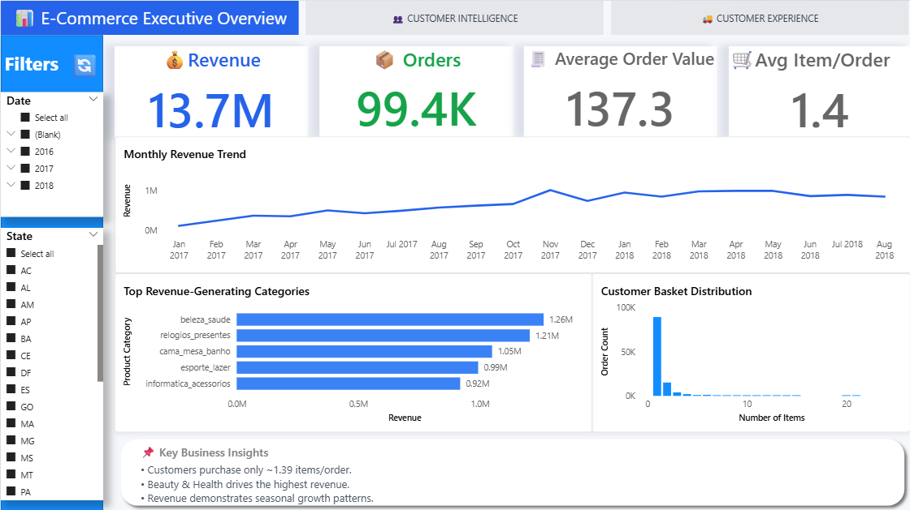
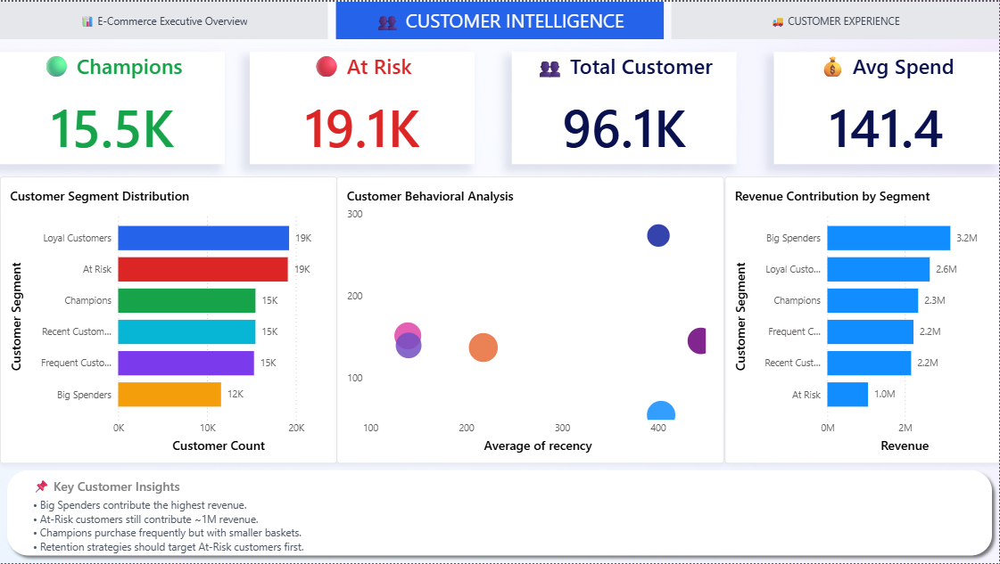
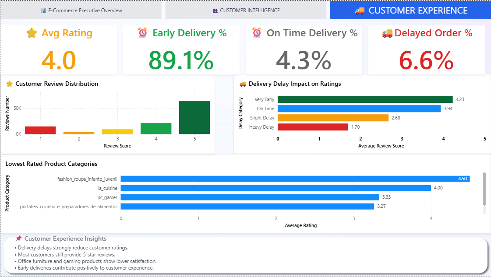
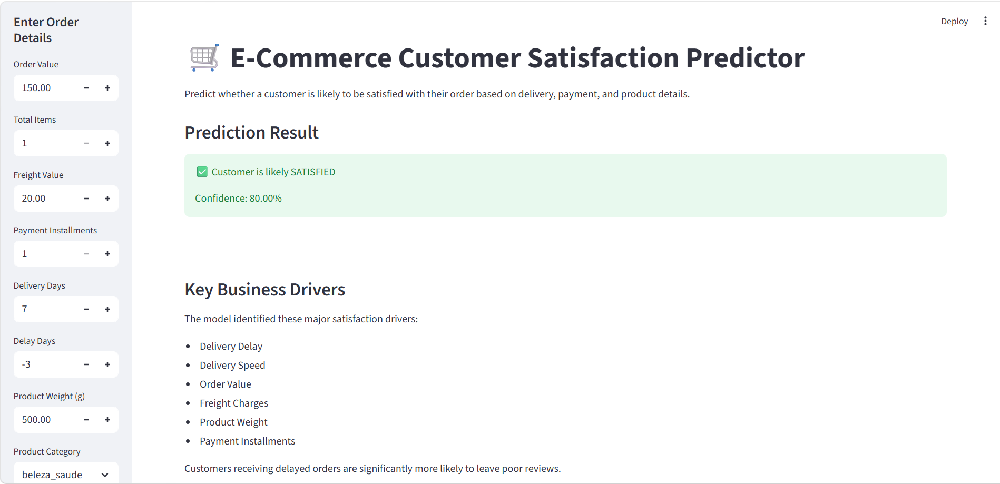

# 🚀 E-Commerce Customer Analytics and Satisfaction Prediction Platform

## Project Overview

This project delivers an end-to-end **E-Commerce Analytics and Machine Learning Platform** built using real-world Brazilian e-commerce data from the Olist marketplace. The solution combines **data engineering, customer segmentation, business intelligence, and machine learning** to transform raw transactional data into actionable business insights and predictive intelligence.

The project focuses on three core business areas:

- **Executive Business Analytics** through interactive Power BI dashboards
- **Customer Segmentation** using RFM Analysis
- **Customer Satisfaction Prediction** using Machine Learning and Streamlit deployment

The overall objective is to help e-commerce businesses better understand customer behavior, monitor operational performance, identify at-risk customers, and proactively predict customer satisfaction outcomes.

---

# 📖 Table of Contents

- [Business Problem](#business-problem)
- [Tools and Technologies](#️-tools-and-technologies)
- [Project Architecture](#️-project-architecture)
- [Project Structure](#-project-structure)
- [Data Processing and Feature Engineering](#-data-processing-and-feature-engineering)
- [Customer Segmentation (RFM Analysis)](#-customer-segmentation-rfm-analysis)
- [Machine Learning Model](#-machine-learning-model)
- [Power BI Dashboard](#-power-bi-dashboard)
- [Streamlit ML Application](#️-streamlit-ml-application)
- [Key Business Insights](#-key-business-insights)
- [Model Performance](#-model-performance)
- [How to Run the Project](#-how-to-run-the-project)
- [Future Scope](#-future-scope)
- [Author and Contact](#-author-and-contact)

---

# Business Problem

E-commerce businesses generate massive volumes of transactional and customer interaction data daily. However, deriving actionable insights from this data remains a challenge due to fragmented systems and lack of predictive capabilities.

The organization faced several operational and business challenges:

- **Customer Retention Issues:** Difficulty identifying loyal, at-risk, and high-value customers
- **Delivery Performance Challenges:** Delayed deliveries negatively impacting customer satisfaction
- **Lack of Predictive Intelligence:** No system to proactively predict customer review outcomes
- **Operational Visibility Gaps:** Limited visibility into product category performance, regional trends, and delivery efficiency

This project addresses these problems through analytics, segmentation, and predictive modeling.

---

# 🛠️ Tools and Technologies

| Category | Tools & Libraries Used |
| :--- | :--- |
| **Programming Language** | Python (3.9+) |
| **Data Processing** | Pandas, NumPy |
| **Machine Learning** | Scikit-learn, Random Forest Classifier |
| **Visualization** | Power BI, Matplotlib |
| **Application Deployment** | Streamlit |
| **Model Serialization** | Joblib |
| **Development Environment** | Jupyter Notebook, PyCharm |
| **Version Control** | Git & GitHub |

---

# 🏗️ Project Architecture

```text
Raw Datasets
     ↓
Data Cleaning & Feature Engineering
     ↓
Exploratory Data Analysis
     ↓
RFM Customer Segmentation
     ↓
Machine Learning Model Training
     ↓
Power BI Dashboard Development
     ↓
Streamlit ML Deployment
```

---

# 📂 Project Structure

```bash
ecommerce-analytics-ml-platform/
│
├── data/
│   │
│   ├── raw/             # Place downloaded Kaggle dataset here
│   │   ├── olist_orders_dataset.csv
│   │   ├── olist_customers_dataset.csv
│   │   ├── olist_order_items_dataset.csv
│   │   ├── olist_order_payments_dataset.csv
│   │   ├── olist_order_reviews_dataset.csv
│   │   ├── olist_products_dataset.csv
│   │   ├── olist_sellers_dataset.csv
│   │   ├── olist_geolocation_dataset.csv
│   │   └── product_category_name_translation.csv
│   │
│   └── processed/                # Generated after running preprocessing pipeline
│       ├── ecommerce_master.csv
│       └── rfm_data.csv
│
├── notebooks/
│   │
│   └── ecommerce_analysis.ipynb
│
├── src/
│   │
│   ├── config.py
│   ├── train_model.py
│   └── predict.py
│
├── models/            # Generated after running preprocessing pipeline or train model
│   │
│   ├── customer_satisfaction_model.pkl
│   └── model_features.pkl
│
├── streamlit_app/
│   │
│   └── app.py
│
├── powerbi/
│   │
│   ├── ecommerce_dashboard.pbix
│   └── ecommerce_dashboard.pdf
│
├── assets/
│   │
│   ├── executive_overview.png
│   ├── customer_segmentation.png
│   └── delivery_review_analysis.png
│
├── requirements.txt
├── README.md
└── .gitignore
```

---

This project uses the Brazilian E-Commerce Public Dataset by Olist, available on Kaggle.

Dataset Link:
https://www.kaggle.com/datasets/olistbr/brazilian-ecommerce

The raw and processed datasets are not included in this repository due to GitHub file size limitations. 
To run the project locally:

1. Download the dataset from the Kaggle link above.
2. Place the raw CSV files inside:
   Data/Raw/

3. Run the notebook or model training pipeline to generate processed datasets.

---

# 🔧 Data Processing and Feature Engineering

The project integrates multiple e-commerce datasets including:

- Orders
- Customers
- Payments
- Products
- Reviews
- Order Items

Several business-focused features were engineered:

| Feature | Description |
| :--- | :--- |
| `delivery_days` | Total delivery duration |
| `delay_days` | Delay against estimated delivery |
| `order_value` | Total order monetary value |
| `total_items` | Number of products per order |
| `payment_installments` | Installment-based payment behavior |

The datasets were merged into a unified analytical dataset for downstream analysis and machine learning tasks.

---

# 👥 Customer Segmentation (RFM Analysis)

RFM Analysis was implemented to classify customers into meaningful business segments based on:

| Metric | Definition |
| :--- | :--- |
| **Recency** | Days since last purchase |
| **Frequency** | Number of purchases |
| **Monetary** | Total money spent |

Customers were segmented into:

- Champions
- Loyal Customers
- Frequent Customers
- Big Spenders
- Recent Customers
- At Risk Customers

This segmentation enables targeted retention and marketing strategies.

---

# 🤖 Machine Learning Model

A **Random Forest Classifier** was developed to predict whether a customer is likely to leave a positive review.

## Target Variable

| Label | Meaning |
| :--- | :--- |
| `1` | Satisfied Customer (Review Score ≥ 4) |
| `0` | Unsatisfied Customer (Review Score < 4) |

## Features Used

- Order Value
- Freight Charges
- Delivery Days
- Delay Days
- Product Weight
- Payment Installments
- Product Category
- Customer State

The model was trained using a stratified train-test split to preserve class balance.

---

# 📊 Power BI Dashboard

The Power BI dashboard provides interactive business intelligence across three analytical layers:

## 1️⃣ Executive Overview

Provides high-level business KPIs including:

- Revenue trends
- Order performance
- State-level analysis
- Monthly sales monitoring



---

## 2️⃣ Customer Segmentation Analysis

Visualizes customer behavior using RFM segmentation:

- RFM customer distribution
- Segment-wise revenue contribution
- Customer behavior analysis



---

## 3️⃣ Delivery and Review Analysis

Analyzes delivery efficiency and customer satisfaction:

- Delivery delay insights
- Review score distribution
- Product category satisfaction analysis
- Delivery impact on customer reviews



---

# 🖥️ Streamlit ML Application

A production-style Streamlit application was developed to deploy the trained machine learning model interactively.

## Application Features

- Real-time satisfaction prediction
- Interactive user inputs
- Prediction confidence score
- Business-driver insights

The application allows users to simulate customer order conditions and predict satisfaction outcomes dynamically.



---

# 📈 Key Business Insights

| Business Insight | Strategic Recommendation |
| :--- | :--- |
| Delivery delays strongly reduce customer satisfaction | Optimize logistics and delivery operations |
| Big Spenders contribute highest revenue share | Develop premium loyalty programs |
| Loyal and Champion customers drive repeat purchases | Prioritize retention-focused campaigns |
| Freight charges impact satisfaction significantly | Improve shipping cost optimization |
| Certain states show consistently higher customer activity | Implement region-specific growth strategies |

---

# 🎯 Model Performance

| Metric | Score |
| :--- | :--- |
| Accuracy | 84% |
| Precision | 84% |
| Recall | 97% |
| Weighted F1-Score | 82% |

## Most Important Predictive Features

- Delay Days
- Delivery Days
- Order Value
- Freight Value
- Product Weight

The model demonstrated strong capability in identifying satisfied customers while maintaining balanced overall performance.

---

# 🚀 How to Run the Project

## 1️⃣ Clone the Repository

```bash
git clone https://github.com/your-username/ecommerce-analytics-ml-platform.git

cd ecommerce-analytics-ml-platform
```

---

## 2️⃣ Install Dependencies

```bash
pip install -r requirements.txt
```

---

## 3️⃣ Train the Machine Learning Model

```bash
python src/train_model.py
```

This generates:

- `customer_satisfaction_model.pkl`
- `model_features.pkl`

inside the `models/` folder.

---

## 4️⃣ Run Streamlit Application

```bash
streamlit run streamlit_app/app.py
```

The application will launch locally in your browser.

---

## 5️⃣ Open Power BI Dashboard

Open:

```text
powerbi/ecommerce_dashboard.pbix
```

using Microsoft Power BI Desktop.

---

# 🔮 Future Scope

Several improvements can further enhance this platform:

- Deep Learning-based satisfaction prediction
- Real-time order monitoring pipeline
- Customer churn prediction
- Recommendation engine integration
- Cloud deployment using AWS or Azure
- API-based ML model serving
- Advanced NLP analysis on review comments

---

# 📧 Author and Contact

## Author
**Jayesh Sanjay Patil**

---

## LinkedIn
https://www.linkedin.com/in/jayesh-patil-83085521a

---

## Email
jayeshpatil7530@gmail.com
